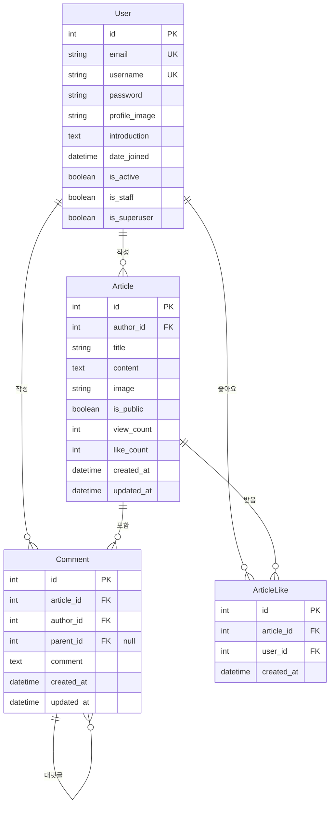

# 테이블 설명

## 1. User (사용자)
- 사용자 정보를 저장하는 테이블
- **주요 필드**:
  - `id`: 고유 식별자
  - `email`: 로그인용 이메일 (고유값)
  - `username`: 사용자 이름 (고유값)
  - `password`: 암호화된 비밀번호
  - `profile_image`: 프로필 이미지 경로
  - `introduction`: 자기소개
  - `is_active`: 계정 활성화 여부
  - `is_staff`: 관리자 권한 여부

## 2. Article (게시물)
- 웨딩 관련 게시물 정보
- **주요 필드**:
  - `id`: 고유 식별자
  - `author_id`: 작성자 ID (User 참조)
  - `title`: 게시물 제목
  - `content`: 게시물 내용
  - `image`: 이미지 경로
  - `is_public`: 공개/비공개 여부
  - `view_count`: 조회수
  - `like_count`: 좋아요 수
  - `created_at`: 작성일
  - `updated_at`: 수정일

## 3. Comment (댓글)
- 게시물에 대한 댓글
- **주요 필드**:
  - `id`: 고유 식별자
  - `article_id`: 게시물 ID (Article 참조)
  - `author_id`: 작성자 ID (User 참조)
  - `parent_id`: 부모 댓글 ID (대댓글용)
  - `comment`: 댓글 내용
  - `created_at`: 작성일
  - `updated_at`: 수정일

## 4. ArticleLike (좋아요)
- 게시물에 대한 좋아요 정보
- **주요 필드**:
  - `id`: 고유 식별자
  - `article_id`: 게시물 ID
  - `user_id`: 사용자 ID
  - `created_at`: 좋아요 시간

# 관계 설명

1. **User - Article (1:N)**
   - 한 사용자가 여러 게시물을 작성할 수 있음
   - `Article.author_id`가 `User.id` 참조

2. **User - Comment (1:N)**
   - 한 사용자가 여러 댓글을 작성할 수 있음
   - `Comment.author_id`가 `User.id` 참조

3. **Article - Comment (1:N)**
   - 한 게시물에 여러 댓글이 달릴 수 있음
   - `Comment.article_id`가 `Article.id` 참조

4. **User - ArticleLike (1:N)**
   - 한 사용자가 여러 게시물에 좋아요 가능
   - `ArticleLike.user_id`가 `User.id` 참조

5. **Article - ArticleLike (1:N)**
   - 한 게시물이 여러 좋아요를 받을 수 있음
   - `ArticleLike.article_id`가 `Article.id` 참조

6. **Comment - Comment (1:N)**
   - 댓글에 대댓글을 달 수 있음
   - `Comment.parent_id`가 같은 테이블의 `id` 참조 (자기참조)
