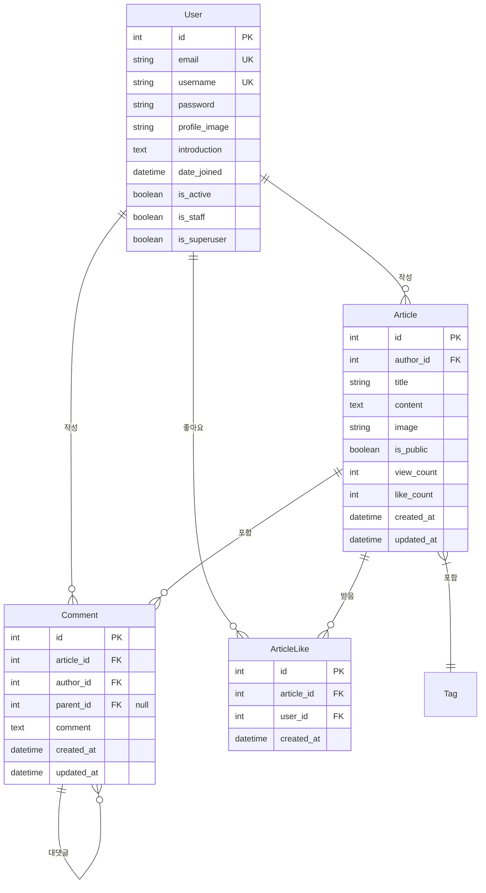

# Whyding

AI 웨딩 사진 합성 서비스

## 🛠 기술 스택

- **Backend**: Django 5.1.4, Django REST Framework 3.15.2
- **Database**: MariaDB
- **Authentication**: JWT (djangorestframework-simplejwt)
- **Documentation**: Swagger/OpenAPI (drf-yasg)
- **Testing**: Django Test Framework, Coverage
- **Image Processing**: Pillow

## 📋 주요 기능

### 1. 사용자 관리
- 회원가입/로그인 (JWT 기반 인증)
- 프로필 관리 (이미지 업로드 포함)
- 비밀번호 변경
- 계정 삭제

### 2. 게시물 관리
- CRUD 기능
- 이미지 업로드
- 태그 기능
- 좋아요 기능
- 조회수 기능
- 공개/비공개 설정

### 3. 댓글 시스템
- 댓글 CRUD
- 대댓글 기능

### 4. 기타 기능
- 태그 기반 검색
- 통계 기능
- 페이지네이션

## ⛓️ERD



## 🚀 시작하기

### 설치 방법

1. **저장소 클론**
```bash
git clone [repository-url]
cd whyding
```

2. **가상환경 설정**
```bash
python -m venv venv
source venv/bin/activate  # Windows: venv\Scripts\activate
```

3. **의존성 설치**
```bash
pip install -r requirements.txt
```

4. **환경 변수 설정**
```bash
cp .env.example .env
# .env 파일 수정
```

5. **데이터베이스 설정**
```bash
python manage.py migrate
```

6. **관리자 계정 생성**
```bash
python manage.py createsuperuser
```

7. **서버 실행**
```bash
python manage.py runserver
```

## 📝 API 문서

- Swagger UI: `/swagger/`
- ReDoc: `/redoc/`

## 🧪 테스트

```bash
# 전체 테스트 실행
python manage.py test

# 특정 앱 테스트
python manage.py test articles

# 테스트 커버리지 확인
coverage run manage.py test
coverage report
coverage html
```

## 📁 프로젝트 구조

```
whyding/
├── accounts/          # 사용자 관리
├── articles/          # 게시물 관리
├── config/           # 프로젝트 설정
├── media/            # 미디어 파일
└── requirements.txt  # 의존성 목록
```

## 🔐 보안

- JWT 기반 인증
- 비밀번호 해싱
- CORS 설정
- XSS/CSRF 방지

## 🔄 API 엔드포인트

자세한 API 문서는 Swagger UI에서 확인 가능합니다.

## 📈 성능 최적화

- 데이터베이스 인덱싱
- 쿼리 최적화 (select_related, prefetch_related)
- 이미지 리사이징

## 📜 라이센스

This project is licensed under the MIT License - see the [LICENSE](LICENSE) file for details

## 🔄 버전 관리

- **v1.0.0** - 초기 릴리즈

## 👥 팀 정보

- 개발자 정보
- 연락처

## 🔜 향후 계획

- [ ] 소셜 로그인
- [ ] 알림 시스템
- [ ] 실시간 채팅

## ⚠️ 알려진 이슈

현재 알려진 이슈들과 해결 방법을 기록합니다.